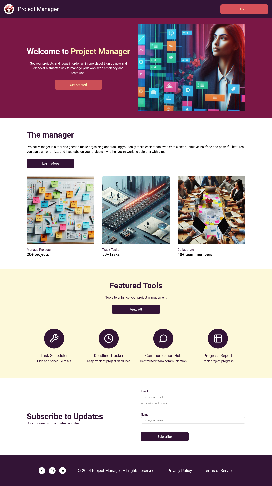
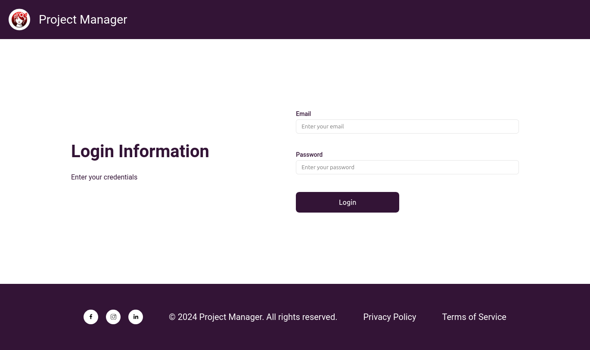
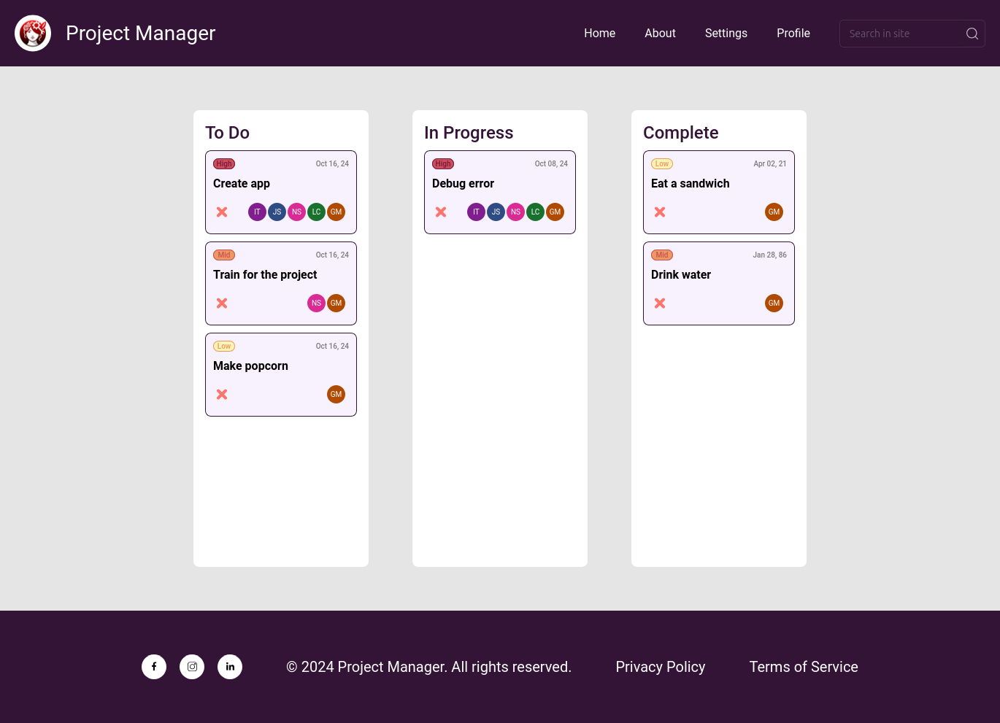

# Desafio 01 - Project Manager

## Descrição do projeto
Esse projeto foi desenvolvido em resposta ao primeiro desafio da turma Front-end Journey (React) - AWS Cloud Context da Compass UOL.
Um arquivo no Figma foi disponibilizado para definição da temática e layout do projeto.
O projeto em si consiste de três páginas: uma home page, uma página de login e uma página que apresenta o kanban.
A construção do projeto utilizando unicamente HTML, CSS e Javascript é mandatória.
O objetivo do projeto é justamente colocar em prática as bases das tecnologias anteriormente citadas.

## Visualização prévia
### Home Page

### Login page

### Kanban Page

## Tecnologias empregadas

As ferramentas utilizadas no processo de construção do projeto foram HTML, CSS e Javascript.

## Funcionalidades do projeto

* Botão clicável que direciona para a página de login no header
* Botão clicável que direciona para a página de login na primeira seção do site
* Ícones clicáveis que redirecionam para as páginas iniciais das redes sociais aos quais representam no footer
* Validação dos campos dos formulários
* Mensagens de erro durante o processo de validação
* Mensagem de sucesso de envio do formulário de inscrição
* Armazenamento das informações do formulário de inscrição no Local Storage após a validação dos dados
* Login para a página do Kanban no formulário de login após a validação dos dados

## Executar o projeto

O projeto em si foi realizado aplicando apneas conceitos de front-end nas páginas.
Para executar o projeto no seu computador, o fluxo indicado é:

1 - Clone esse repositório para o seu dispositivo 
2 - Abra a página index.html em seu navegador de preferência 
3 - Teste as funcionalidades do site 

